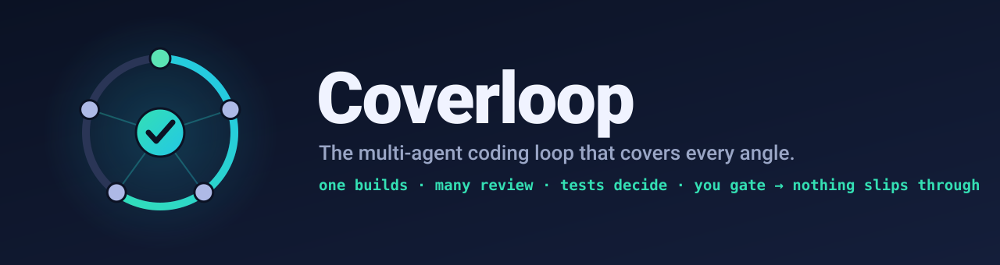
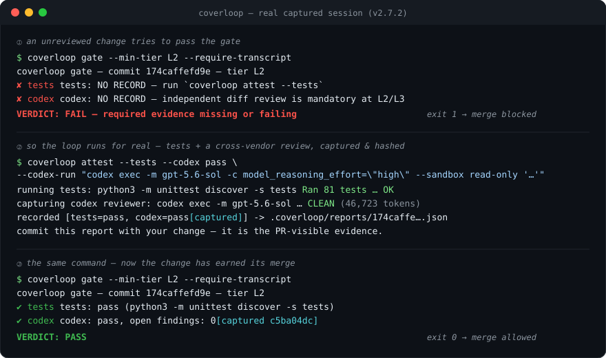
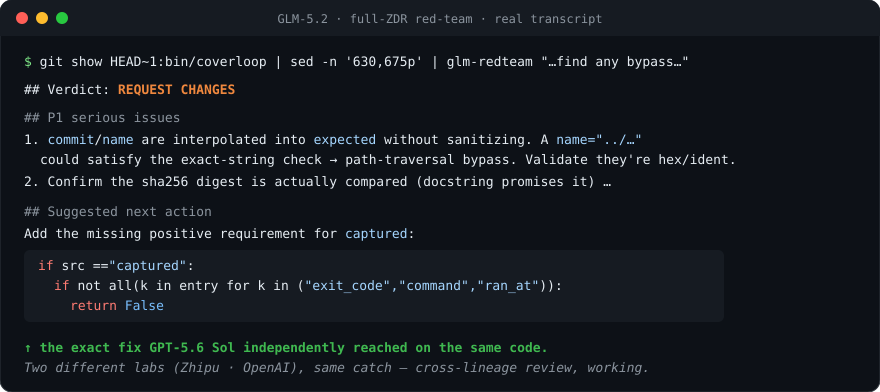
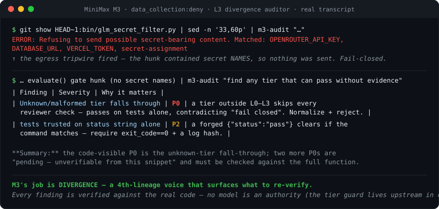
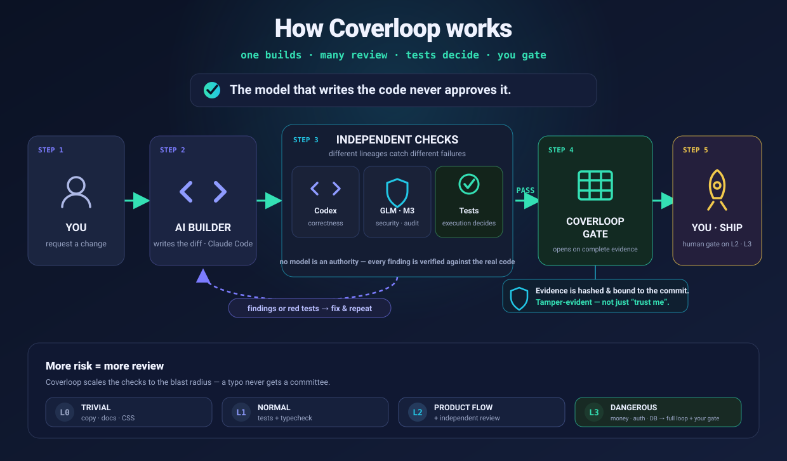

<div align="center">



<h3>Never let the model that wrote the code be the one that approves it.</h3>

**A CLI and Claude Code plugin that stops a commit until independent models and your own tests have signed off — and only for the changes that can actually hurt you.**

<br/>

[](LICENSE)
[](https://claude.com/claude-code)
[](tests/)

[**Install**](#-install) · [**Real bugs it caught**](#-real-bugs-it-caught) · [**What it costs you**](#-what-it-actually-costs-you) · [**What runs on your machine**](#-what-actually-runs-on-your-machine)

</div>

---

You let Claude write a migration, a Stripe webhook, an RLS policy. It says *"done, all tests pass."* It is the only thing that checked.

**That is the problem.** Not that AI writes bad code — it mostly doesn't — but that on the ~10% of changes that can delete data, leak a tenant's rows, or break checkout, **the only reviewer is the author**, and it is an author with no stake in being wrong.

Coverloop makes those changes earn their way out: it works out how dangerous the change is **from the files it touches**, sends it cold to a reviewer from a different lab, gives your tests the deciding vote, and **stops** on the ones that can hurt until you say go. On everything else it stays out of your way — a CSS tweak never calls a model.

---

## ⏱️ What it actually costs you

The question nobody answers on pages like this. Measured, on this repo:

| | wall-clock | money |
|---|---|---|
| `coverloop classify` — how risky is this change? | **0.5 s** | free |
| `coverloop gate` — is the evidence complete? | **0.5 s** | free |
| **L1** — tests, typecheck, no model call | your test suite | free |
| **L2** — adds an independent diff gate | **+ ~14 s** | on your ChatGPT plan, not per-token |
| **L3** — adds a red-team pass and hashed evidence | **+ ~30 s** | ~2–4¢ |
| **L3, the part that costs you** — reading the diff and approving it | **however long you take** | your attention |

That last row is the real price, and no table can shrink it. Everything above it is machine time you can ignore; the human gate is the one thing Coverloop deliberately will not do for you.

**You also need a ChatGPT account** for the independent gate (see [below](#-the-independent-gate-needs-its-own-account--and-thats-deliberate)) — realistically a paid one if you ship daily. That is a recurring cost this page would be dishonest to leave out of a section called "what it actually costs you".

**And how often does that happen?** Here is `classify` run over the last 40 real commits of three production repos:

| Repo | L0 | L1 | L2 | **L3 (the full stop)** |
|---|---:|---:|---:|---:|
| Call platform — billing, auth, worker, migrations | 5% | 33% | 15% | **47%** |
| Music app — game logic, UI, no money path | 8% | 45% | 47% | **0%** |
| Music app — second codebase | 18% | 40% | 40% | **2%** |

Read that honestly, because it is the most important thing on this page: **if your product is billing plus auth plus migrations, roughly half your commits will stop and wait for you.**

That is a real cost, and it cuts against the reason you're here — you want Claude to ship *more* unattended, not less. A stop that fires on half your work is a stop you learn to rubber-stamp by week two, which is the same failure this tool warns about for over-classification, one notch up.

So the stop is adjustable, and the automated review is not:

```bash
coverloop gate --human-gate-scope irreversible
```

Every L3 change still gets the whole automated loop — tests, an independent diff gate, a red-team pass, hashed commit-bound evidence. What narrows is **which ones wait for you personally**: only the ones you cannot take back — schema migrations, money paths, and authz/RLS policy. On the same repo, that moved human stops from **47% to 25%** of commits.

It is opt-in, and stays opt-in. Quietly relaxing an existing user's gate on upgrade is precisely the kind of unannounced weakening this project exists to make impossible — so if you want it, you type it.

**And if your app has no money path and no auth**, the picture inverts: L3 essentially never fires, most changes land in L1/L2, and the whole loop costs you a diff review that a model does in fourteen seconds.

---

## ⚡ Install

**Two commands to install.** Inside Claude Code:

```
/plugin marketplace add danielsimisi-coder/coverloop
/plugin install coverloop@coverloop
```

Paste your [OpenRouter key](https://openrouter.ai/keys) when it asks — Claude Code stores it in your OS keychain, so there's no key file and no `chmod`. Then, in any project:

```bash
coverloop doctor      # what's installed, what's missing, and the exact fix for each
coverloop init        # once per repo
```

<details>
<summary><b>Manual install</b> (no plugin — clone + <code>install.sh</code>)</summary>

<br/>

```bash
git clone https://github.com/danielsimisi-coder/coverloop.git
cd coverloop && ./install.sh
printf '%s' 'sk-or-...' > ~/.config/openrouter/api_key && chmod 600 ~/.config/openrouter/api_key
~/bin/protocol-selftest
```

Same tool, more steps — and you own the `PATH` and file modes yourself. `coverloop doctor` works either way and will tell you what's still missing.

</details>

> **What you need:** [Claude Code](https://claude.com/claude-code) · Python 3 + git · an [OpenRouter](https://openrouter.ai) key. **Mac/Linux** (Windows → [WSL](https://learn.microsoft.com/windows/wsl/install)). **No server or VPS.**
> Full walkthrough (machine → project → session): [`docs/SESSION_BOOTSTRAP.md`](docs/SESSION_BOOTSTRAP.md)

### 🔍 What actually runs on your machine

A safety tool that won't say what it executes is asking for the blind trust it exists to remove. So, precisely:

| Runs on its own | What it does |
|---|---|
| at session start, and after every context compaction | **Prints text.** Re-states the standing rules so a long session doesn't quietly drop your standards. |
| before a Bash call containing push / merge / migrate / deploy | **Prints a reminder** of what this tier still owes. It does not block and changes nothing. |
| when Claude finishes a turn | Checks whether the repo has tests that should have run. |
| after a failed tool call | Captures the error text so the loop can learn from it. |

**None of them touch the network. None of them send your code anywhere.** The first two are elaborate `echo`s.

Everything else — `classify`, `gate`, the reviewers — is a command **you or your agent runs**, and every run goes through Claude Code's normal Bash approval. The plugin puts them on your `PATH`; it does not get to fire them.

Your code leaves your machine **only** when a reviewer is explicitly invoked, and only after the secret filter has stripped values from the packet. `coverloop gate` sends nothing at all — it reads local files and git metadata.

### 🕵️ The independent gate needs its own account — and that's deliberate

The reviewer that gates your diff must come from a **different lineage than the builder**. That means the [Codex CLI](https://developers.openai.com/codex/cli), signed in with your ChatGPT account:

```bash
npm i -g @openai/codex && codex login
```

**Why not route it through the OpenRouter key you already have?** I tried, and shipped it, and then measured it properly: **no OpenAI model on OpenRouter offers strict zero-data-retention** — only `data_collection: deny`, which is a weaker promise. Running your *highest-authority* reviewer at a *lower* privacy bar than your red-team is backwards, so that shortcut was removed rather than documented around. Codex keeps the diff inside your own OpenAI account and never transits OpenRouter at all.

`coverloop doctor` tells you if it's missing and gives you the line above. It's a one-time, two-minute cost.

### 🔒 Make it unskippable — `coverloop gate`

Reminders are for people who already behave. For everyone else there's an **enforceable, fail-closed gate**: every review records evidence into `.coverloop/reports/<commit>.json` (committed with the change, visible in the PR), and `coverloop gate` exits non-zero unless the evidence governing that commit is complete — tests green, reviews passed, and for dangerous changes a *named* human approval. Evidence-only commits ride along; **any *committed* code change after attestation invalidates the evidence by construction** — for *uncommitted* edits you need `gate --require-clean-tree`, which is opt-in.

```bash
coverloop init                                  # once per repo
coverloop classify                              # what risk is this change, really?
coverloop attest --tier L2 --tests              # run + record tests
coverloop attest --codex pass                   # record the independent review
coverloop gate --min-tier "$(coverloop classify --quiet)"   # exit 0 only if the evidence is complete
```

Add `--codex-run "<cmd>"` and the tool **runs the reviewer and commits its hashed output** as evidence — or, for the review you **already ran interactively**, `--codex-log <file>` attaches its transcript (redacted, hashed, committed) with **no re-run**. The gate labels each verdict `[captured <hash>]` / `[attached <hash>]` vs `[self-attested]`, so a reviewer can tell a real transcript from a bare claim. Wire it as a **required GitHub check** ([copy-paste workflow](examples/github-actions-coverloop.yml), SHA+checksum-pinned) — and once you also turn on branch protection, a change with missing evidence can't merge without either the evidence or a human explicitly overriding the check (the honest ceiling — see the limits note below and [`docs/GATE.md`](docs/GATE.md)).

### 🎚️ The tier isn't yours to declare — `coverloop classify`

Every gate above keys off the **risk tier**. So if the tier is just *declared*, one mislabel — a typo, a hurry, an optimistic agent — silently skips the whole L3 chain. No alarm. No evidence that anything was skipped. **That is the one place this design could be defeated for free**, so the tier is now *derived*:

```console
$ coverloop classify
coverloop classify: L3  (4 file(s), working tree vs HEAD (incl. untracked))
  - L0: documentation (README.md)
  - L3: authentication / authorisation / RLS (src/auth/session.ts)
  - L1: source change (no specific rule matched) (src/ui/Toast.tsx)
  - L3: database migration (supabase/migrations/20260803_add_col.sql)
```

Migrations · SQL · schema · auth/RLS · billing · secrets/`.env` · CI-deploy config · workers/cron → **L3**. API routes · shared state · dependency manifests → **L2**. Docs · styles → **L0**. **Anything unrecognised → L1, never L0** — silence is not evidence of safety. **10+ files → at least L2**, because breadth is its own risk.

Three things make this trustworthy rather than decorative:

- **It's a floor, not a verdict.** `gate` takes the MAX of it, any other `--min-tier`, and the report's own tier; `attest --tier` already refuses to downgrade. You may **raise** a tier. **Nothing may lower a deterministic floor** — not you, not the agent.
- **It's path-based on purpose.** Paths are cheap, stable, and reviewable, and dodging L3 by renaming a migration out of `migrations/` requires something *visible in the diff*. Content sniffing was rejected: easy to defeat with formatting, and its false negatives read like safety.
- **Over-classification is treated as a real cost.** A floor that cries L3 at a stylesheet trains people to bypass the gate, and a bypassed gate protects nothing — so the app-code rules are scoped to source extensions. (That bug was ours: `hooks/` once matched this repo's own shell hooks. It's pinned by a regression test now.)

**Here's the whole idea in one real session** — captured verbatim from Coverloop gating its own repo (only long paths elided). The gate blocks an unreviewed change, the loop earns the evidence (real test run + a GPT-5.6 cross-vendor review, hashed), and the same command opens:

<p align="center"></p>

<details>
<summary><b>…and the same change, seen by the other two reviewers (also real transcripts)</b></summary>

<br/>

Different training lineages catch different things — that's the whole point of a multi-model loop. Here is the *same code*, red-teamed by **GLM-5.2** (full zero-data-retention) and audited by **MiniMax M3** (a fourth-lineage divergence voice), captured verbatim:

<p align="center"></p>

<p align="center"></p>

**Two things these show that a single reviewer can't:** GLM independently reached the *exact* fix GPT-5.6 Sol did (cross-lineage convergence is a strong signal a finding is real), and M3's egress filter *refused to send* a hunk containing secret names — the privacy layer failing closed, not on prompt discipline. No model is an authority: every finding is then checked against the real code.

</details>

> **Honest about the limits** (full detail in [`docs/GATE.md`](docs/GATE.md)): a bare `attest --codex pass` is a committed *claim* — back it with a transcript (`--codex-run` executes and captures; `--codex-log` attaches an existing one, honest label included), and `gate --require-transcript` makes CI **reject** anything less (`--require-executed` is stricter: coverloop must have run the reviewer itself; `--require-captured` remains as a deprecated alias). `coverloop classify` derives a tier floor from the changed paths and the gate takes the MAX, so a tier can be raised but never lowered; what `classify` cannot see is intent — a genuinely dangerous change in an innocuous-looking file still needs you to raise it. Human approval is *named*, not GitHub-authenticated (that's on the roadmap) — but `gate --require-signed-commit` adds **cryptographic provenance**: it demands HEAD carry a git-verifiable signature from a *trusted* key (checked against your git trust, or a **repo-committed signer policy** read from the committed tree), so evidence can't be replayed onto a forged or unsigned commit. Transcript redaction covers **known secret + PII patterns** (keys, tokens, DB creds, home-dir usernames, emails, session UUIDs) — a tripwire, not a full DLP guarantee. The gate raises the cost and visibility of lying; it doesn't make lying impossible. That's the honest ceiling for a tool that runs on your machine.

---

## 🐛 Real bugs it caught

These are bugs the loop caught **in its own tooling**. Most were caught before they merged; the largest batch was not — it was found in an already-published release, which is the more useful demonstration and the less flattering one. That is circular evidence and you should read it as such — it shows the *class* of bug multi-model review finds, not that it will find bugs in your app. [Real-project numbers are below.](#and-what-it-looks-like-on-someone-elses-product)

> **The self-audit that says it best.** A release had just shipped claiming that the risk tier was no longer the author's to declare. Running the protocol against that release — a cold diff, a fresh session each round, a reviewer with no stake in the answer — showed the claim was not yet true, and then kept going. **Nine rounds, 45+ defects, every one verified against the code before it was fixed and regression-locked afterwards.** Among them: a rename from `authGuard.ts` to `guard.ts` walked the change straight past the classifier; `--base=--cached` reached `git diff` as a *flag*, so it compared the index, classified nothing, and the gate passed; `PASSWORD="alpha\nbeta"` redacted only its first line, leaving a tail that then **scanned clean** and would have been transmitted; and a hand-planted `L0` report on a migration commit was accepted as a trusted baseline, hiding that migration from every later check.
>
> **Roughly one defect in seven was created by the previous round's fix.** The worst was a length cap added to stop a secret leak, which instead made long secrets fail to match *at all* — so nothing was redacted and the whole value went out, strictly worse than the bug it replaced. Three separate rounds were the same bypass surviving one layer lower each time: the fix went into the classifier, then the collector still normalised the path, then three other callers still collected paths line-by-line. It stopped being fixed instance-by-instance only when a test was added that fails if *any* path-producing call sits outside the one collector.
>
> The drift that started it is the same *attest-then-drift* failure this repo's own field audit documents — committed by the person who wrote the audit, in the week he wrote it.
>
> The ninth round returned `PASS` from both reviewers, and **this repo now passes its own gate**: `coverloop gate` on a fresh clone exits 0 with tests, both reviewer transcripts, and the human gate recorded against the commit SHA. [The full account is in the CHANGELOG](CHANGELOG.md); [the numbers, including the false positives, are in the ledger](docs/REVIEW_LEDGER.md).

| The bug | Who caught it | What it would've done |
|---|---|---|
| **Two rival labs, one catch:** GPT-5.6 Sol **and** GLM-5.2 *independently* reached the exact same fix on the gate's own evidence code — a forged reviewer entry could otherwise pass the strictest check | **Sol + GLM** (cross-lineage) | The strongest signal a finding is real: convergence across training lineages, not a shared hallucination (transcripts below) |
| The privacy tool was **committing your home-directory username** (and emails, session IDs) into review transcripts in git — secrets were redacted, personal identifiers weren't | **Codex/Sol** (parity audit) | A "privacy" tool quietly leaking PII into your public history |
| **A P0 in `coverloop gate` itself:** committing the evidence report creates a new commit, so CI could never find the evidence for the commit carrying it — the documented flow was impossible. The builder missed it. **All 17 tests that existed then were green.** | **Codex** (diff review) | The flagship enforcement feature would have shipped broken — every CI run failing forever ([see CHANGELOG v2.6](CHANGELOG.md)) |
| A model call **sent your data before** the privacy guard's failure-check ran; and an exported env var could **silently override** the zero-data-retention routing | **Codex** (diff review) | A payload leaving your machine even when it should've been blocked — routed to a non-ZDR endpoint without you knowing |

### …and what it looks like on someone else's product

Those are bugs in Coverloop's own machinery, which is a fair thing to be sceptical about — a tool that only finds bugs in itself has an audience of one. So here is the [ledger from a live client project](docs/REVIEW_LEDGER.md): a production call platform with billing, auth, a worker and real customers.

| | count |
|---|---:|
| Findings the reviewers raised | **18** |
| Did **not** survive verification against the code | **12** |
| Already fixed / won't-fix / a process gate, not a bug | **5** |
| Real bugs found that nothing else caught | **1** |

**Two-thirds of what the reviewers called P0/P1 was wrong.** That is the number most tools would leave out, and it is the most useful one on this page: it is exactly why nothing here lets a model block your merge on its own say-so, and why every finding has to survive a check against the real code first.

The one that survived: the optional fourth-lineage auditor noticed a status label that mapped one failure reason but not another, so three separate views would have shown customers and staff the wrong outcome. **Tests were green. The other reviewers missed it.**

Twelve false positives bought one real catch. Whether that trade is worth it on *your* codebase is what the ledger is for — and when a reviewer stops earning its place, the protocol tells you to remove it.

*(Caught something in **your** codebase? [Open a PR](#contributing) and I'll feature it here.)*

---

## Why it works

<p align="center"></p>

**No model is an authority.** Every finding is a *claim* — verified against real code, tests, and runtime before it can block anything. Two models agreeing can just mean two models hallucinating the same thing, so **execution beats opinion**: when a test can settle it, you run the test.

**Right-sized, never bloated.** A typo doesn't get a committee. Coverloop scales the review to the blast radius:

| Risk | Example | What it gets |
|:---:|---|---|
| **L0** trivial | copy, CSS | quick check |
| **L1** normal | isolated fix | tests + typecheck |
| **L2** product flow | onboarding, admin UX | ➕ mandatory independent review |
| **L3** dangerous | money, auth, migrations, deploy, secrets | full suite + red-team + 2nd auditor + **your gate** |

---

## 🧠 Five decisions that make it usable

Most "AI reviewer" setups die the same way: they cry wolf until you stop reading them. These five exist to stop that, and each came out of a real failure — the rest of the machinery is in [`CLAUDE.md`](CLAUDE.md).

- 🎭 **Agreement isn't proof.** Two models agreeing can be two models hallucinating the same thing. Agreement is a triage hint; the code and the tests decide.
- 📍 **A finding without `file:line` is noise.** Reviewers are instructed to cite the line or stay quiet — this is the single biggest cut to the over-reporting that makes solo AI review exhausting.
- 📒 **A false-positive ledger.** Once a finding is judged wrong it's written down and not raised again. [See what a real one looks like](docs/REVIEW_LEDGER.md) — including the two-thirds-wrong ratio it exists to manage.
- ✂️ **"Split, don't grind."** If the same real issues keep surfacing past a round cap, the change is too big to review well. It tells you to split the PR instead of looping.
- 🥶 **Reviews are cold reads.** The reviewer never sees the change inside the conversation that wrote it — it gets a fresh session and a diff. Removing the author's context is the strongest anti-bias lever there is; a different lab is the second.

<details>
<summary><b>The rest of the machinery</b> — provenance, atomic evidence, fuzzed privacy filter, spend cap</summary>

<br/>

- 🔐 **Provenance, not just claims.** `gate --require-signed-commit` demands HEAD carry a git-verifiable signature from a trusted key — checked against your git trust or a repo-committed signer policy, optionally read from a **protected ref a PR can't rewrite**, so a branch can't add its own key and self-authorize.
- ⚛️ **Evidence writes are atomic and lock-serialized**, so a gate reading mid-write never sees a torn report and two concurrent attests never lose each other's evidence.
- 🧪 **The privacy filter is fuzz-tested against itself** across thousands of seeded inputs — it has already caught real catastrophic-backtracking (ReDoS) holes in the egress path before they shipped, and an adversarial audit of this repo caught a username shape it was still missing.
- 🕳️ **Evidence can't vanish into `.gitignore`.** If a repo's `*.log` rule would swallow a transcript, `attest` refuses to record it.
- 💸 **A daily spend cap.** The reviewer CLIs count what was actually sent today and fail closed past `COVERLOOP_DAILY_REVIEW_CAP` (default 40; `0` disables) — a runaway loop can't drain your budget overnight.
- 🧬 **Batch-merge integration gate.** After a stack of PRs merges, the combined `main` is a state no single PR's CI tested, so one cumulative review runs on the union.
- 🎚️ **Effort is chosen per tier, not left on the default.** Reviewer wrappers ship per effort level because a judge left on "low" is worse than no judge.

</details>

## ♻️ It stops forgetting — and gets smarter

- **Anti-drift:** the rules are inlined in the auto-loaded `CLAUDE.md` and re-injected by a hook **after every context compaction** — so a long session never quietly abandons your standards.
- **Self-improving memory:** durable lessons are saved to **git-tracked memory** that travels with the repo, so every new session — on any machine — starts smarter than the last.
- **Privacy at the tool layer:** known **secret** shapes (keys, tokens, DB creds, `.env` assignments) have their **values stripped** before any send, and a packet that still scans as secret-bearing afterwards is refused outright; **PII** shapes (home-dir usernames, emails, session ids) are scrubbed from committed transcripts (a redaction tripwire, not egress-blocked); the most sensitive reviews route only to a zero-data-retention endpoint; a slopsquatting gate blocks hallucinated dependencies.

<details>
<summary><b>See the mechanics (anti-drift, privacy, memory, versioning)</b></summary>

<br/>

**Anti-drift.** Long sessions "forget" instructions because automatic **context compaction** summarizes away anything read once, and attention decays as the window fills. Coverloop inlines the Operating Contract in the auto-loaded `CLAUDE.md` (re-read after every compaction), a `SessionStart` hook re-injects the standing rules at every start and after every compaction, and a `PreToolUse` hook re-states the gate checklist right before `git push` / `merge` / migration / deploy.

**Privacy.** Tiered egress (public → proprietary → sensitive → secrets/PII, never sent). The most sensitive packets route only to a verified zero-data-retention endpoint; a boundary-aware filter strips `.env`/key/token/DB-URL **values** before any send and refuses a packet that still scans dirty; an append-only egress log records a hash of every payload (never the body). Review transcripts committed as evidence are additionally scrubbed of PII shapes — home-directory usernames, emails, session UUIDs — before they touch git (a pattern tripwire, not a full DLP pass, and the docs say exactly that).

**Self-improving memory.** Durable lessons live in a git-tracked `docs/MEMORY.md` (capped and consolidated, not hoarded); recurring workflows are captured as reusable `SKILL.md` recipes; every review logs one line to a ledger so you can **subtract** any reviewer that isn't catching real bugs.

**Versioning.** `PROTOCOL_VERSION` (doc + tooling) bumps freely; `CONTRACT_VERSION` (the block in each project) bumps only when its content changes — so tooling updates cost your repos zero resyncs.

</details>

---

## 📦 What's in the box

```
bin/coverloop               the enforceable evidence gate (init / classify / attest / gate)
CLAUDE.md                 the canonical rules (drop into any project root)
docs/GATE.md                gate docs: schema, tiers, CI wiring, threat model
docs/OPERATING_CONTRACT.md the block you inline into a project's CLAUDE.md
docs/SESSION_BOOTSTRAP.md   what to install + what to paste, in order
docs/MEMORY.example.md      template for git-tracked portable memory
docs/REVIEW_LEDGER.md       false-positive ledger + review log
bin/protocol-selftest       one-command wiring + drift check
bin/glm-* / m3-*            privacy-routed, secret-filtered reviewers
bin/dep-check               slopsquatting / hallucinated-dependency gate
hooks/                      SessionStart re-injection, pre-push gate, test gate
skills/                     reusable recipes (multi-model review, reflect-and-save)
examples/                   copy-paste GitHub Actions workflow
install.sh · init-project.sh  machine + per-repo setup
tests/                      the gate's own suite — 172 cases (unit + property/fuzz + concurrency), stdlib-only, CI green on Linux·macOS (Windows WIP)
CHANGELOG.md                the story of how it got here
```

---

## 🙋 FAQ

<details><summary><b>Is this actually enforced, or just conventions?</b></summary><br/>Both layers exist, honestly labeled. Inside the session, hooks re-inject the rules (advisory — they keep the agent on-protocol). At the boundary, <a href="docs/GATE.md"><code>coverloop gate</code></a> is <b>fail-closed enforcement</b>: it exits non-zero unless commit-bound evidence of tests + reviews + human approval exists, and you can make it a required GitHub check so an unreviewed change cannot merge. Evidence is a committed JSON artifact in the PR, not a claim in a chat log.</details>

<details><summary><b>Do I need a VPS or a server?</b></summary><br/>No. Coverloop runs on your normal laptop or desktop. A server only matters if you <i>already</i> run your AI agent on one.</details>

<details><summary><b>Does it cost money to run?</b></summary><br/>The tooling is free and open source. The reviewer models run through OpenRouter (pay-as-you-go, usually a few cents per review). You decide which change tiers trigger the paid reviewers — trivial changes don't call them at all. And there's a <b>daily spend guardrail</b>: the reviewer CLIs count reviews actually sent today and <b>fail closed</b> once you hit a daily cap (<code>COVERLOOP_DAILY_REVIEW_CAP</code>, default 40; set <code>0</code> to disable) — so a runaway review loop or several parallel projects can't silently drain your token budget.</details>

<details><summary><b>Which AI coding tool does it work with?</b></summary><br/>Built for <b>Claude Code</b> (auto-loaded <code>CLAUDE.md</code> + hooks), with <b>Codex CLI</b> as the independent diff reviewer. Other agents that read <code>AGENTS.md</code> and support hooks can be adapted.</details>

<details><summary><b>Is my code / are my secrets safe?</b></summary><br/>Privacy is a core design goal, with honest limits. Known <b>secret</b> shapes (keys, tokens, DB credentials, <code>.env</code>-style assignments) are stripped from the payload before any model call; <b>personal identifiers</b> (usernames, emails, session ids) are redacted from committed transcripts but are not egress-blocked — it's a pattern-based tripwire, not a full DLP guarantee. The most sensitive reviews route only to a zero-data-retention endpoint. The gate itself never sends code anywhere — it only reads local files and git metadata.</details>

<details><summary><b>Can I use different models?</b></summary><br/>Yes. The reviewer CLIs route through OpenRouter, so you can swap the models by editing the helper scripts. The <i>roles</i> (builder · diff-gate · red-team · auditor · human gate) matter more than the exact models.</details>

<details><summary><b>Windows?</b></summary><br/>Supported today on <b>Linux and macOS</b> — CI runs the full stdlib-only suite green on both across Python 3.9/3.11/3.13. <b>Native Windows is in progress</b>: the gate runs, but some tests still assume POSIX file semantics (a few leak file handles that Windows locks), so the Windows CI leg is not green yet — run under <a href="https://learn.microsoft.com/windows/wsl/install">WSL</a> for now. The <i>shell hooks</i> are bash (WSL or Git Bash) regardless.</details>

---

## Contributing

Issues and PRs welcome — especially new reviewer adapters and risk-map templates for other stacks, and **real bugs Coverloop caught for you** (I'll feature them). Fork it, swap the roster for your own models, and tell me what broke. Licensed under [MIT](LICENSE).

<div align="center">
<br/>

### Cover every angle before you ship.

*Coverloop started as one founder's answer to a simple question:*
**how do I let AI write most of my code without letting a single bug reach a paying customer?**

<br/>

⭐ **If that question keeps you up too, star it.**

</div>
