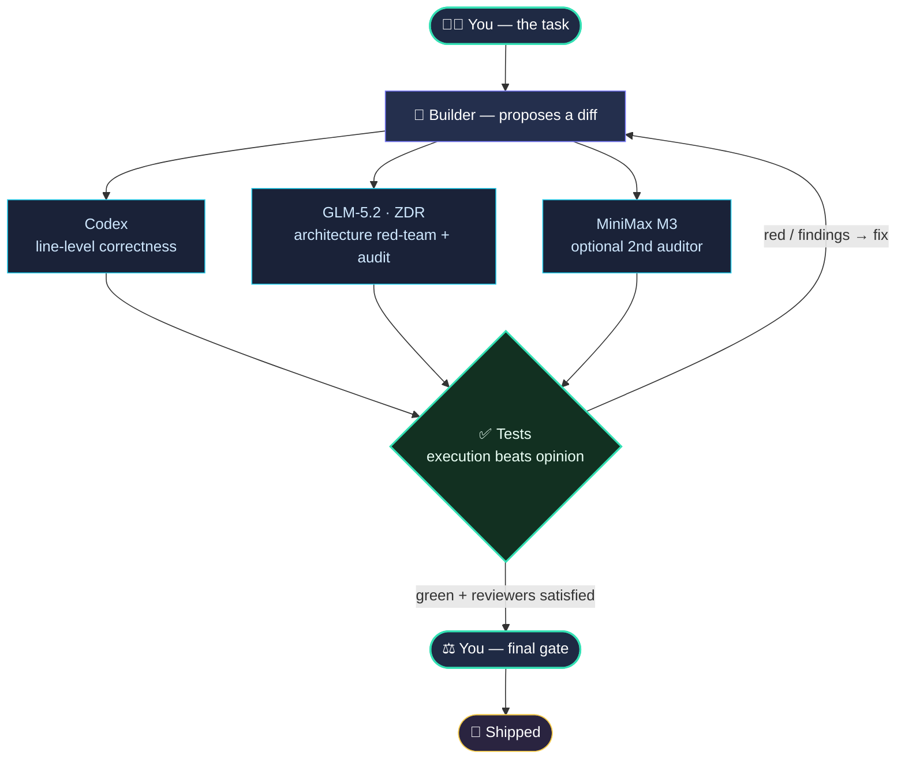

<div align="center">


<br/>

**One model builds. Independent AI models review it from every angle. Tests decide. You hold the final gate.**

Ship AI-written code at full speed — without letting a single bug reach a paying customer.

<br/>

[](LICENSE)
[](CHANGELOG.md)
[](https://claude.com/claude-code)
[](#the-loop-in-30-seconds)
[](#contributing)

[**Quickstart**](#-quickstart) · [**How it works**](#how-it-works) · [**Why**](#why-this-exists) · [**Philosophy**](#design-philosophy)

</div>

---

## The loop in 30 seconds



**No model is an authority.** Every finding is a *claim* — verified against real code, tests, and runtime before it's allowed to block anything. A bug has to slip past **every reviewer *and* your test suite** to survive. That's the whole idea: cover every angle, so nothing falls through the cracks.

---

## Why this exists

AI writes code fast. The problem is everything *after* the code:

- 🕳️ **One reviewer misses bugs.** A single model — even a great one — rubber-stamps its own blind spots. Real defects hide in the gaps no single reviewer checks.
- 🧠 **Long sessions forget the rules.** As the context window fills and compacts, the agent quietly drops the standards you set an hour ago and starts "vibing" past your guardrails.
- 🔓 **Privacy leaks by accident.** Secrets, `.env` files, and customer data get pasted into model calls with nobody watching.
- ⚠️ **"It passed" ≠ "it's correct, migrated, deployed, and safe."**

Coverloop turns AI-assisted development into a **disciplined, gated pipeline**: a builder proposes, independent reviewers attack from different angles, your tests get the deciding vote, and *you* hold the gate on anything risky. A change ships only when they agree.

It's **not a framework you install into your app.** It's a protocol + a handful of small scripts that drop into any repo and run inside the AI coding tools you already use.

### Single model vs. Coverloop

| | 🤖 One AI, one pass | 🔁 Coverloop |
|---|---|---|
| **Review** | The model checks its own work | Independent models, each a different angle |
| **Blind spots** | Whatever that model misses, ships | A bug must beat *all* reviewers + tests |
| **Source of truth** | The model's opinion | Tests & runtime — opinion is just a claim |
| **Long sessions** | Silently drifts off the rules | Rules re-injected every session & compaction |
| **Secrets** | "Please be careful" | Blocked at the tool layer, before any send |
| **Risky changes** | Same treatment as a typo | Escalated to a human gate |
| **Over time** | Repeats the same mistakes | Saves lessons to memory that travels with the repo |

---

## What you get

| | |
|---|---|
| 🧩 **Multi-model review** | A **builder** proposes; independent **reviewers** (line-level + architecture red-team + a second auditor) attack from different angles. Verified against code and tests — never a rubber stamp. |
| ✅ **Execution is the primary gate** | Tests and typecheck outrank any model opinion. When a test can settle a question, you run the test instead of stacking more LLM guesses. |
| 🧠 **It stops forgetting** | The rules live **inlined in the auto-loaded instructions** (they survive context compaction) and a `SessionStart` hook re-injects them every session and after every compaction. No more mid-session drift. |
| 🔒 **Privacy at the tool layer** | Secrets never leave — enforced by a hard filter + zero-data-retention routing + an append-only egress log. Not by prompt-begging. |
| ♻️ **Self-improving** | Durable lessons are saved to **git-tracked memory** that travels with the repo, so every new session — on any machine — starts smarter than the last. |
| ⚖️ **Right-sized, not bloated** | Risk tiers (L0–L3) decide how much review a change earns. A typo stays fast; money/auth/migrations get the full treatment. The protocol actively **subtracts** machinery that isn't earning its keep. |
| 🩺 **One-command health check** | `protocol-selftest` verifies the whole wiring — versions, hooks, tools, privacy routing, memory — in a single command. |
| 🚀 **Turnkey** | `install.sh` (machine) + `init-project.sh` (repo) and you're wired. Built and hardened on live production apps, not a whiteboard. |

---

## Risk tiers decide the rigor

Not every change deserves a committee. Coverloop sizes the review to the blast radius:

| Risk | Example | What it gets |
|:---:|---|---|
| **L0** · trivial | copy, comments, CSS | quick check |
| **L1** · normal | isolated fix, small refactor | relevant tests + typecheck |
| **L2** · product flow | onboarding, admin UX, a11y | ➕ a mandatory independent diff review |
| **L3** · dangerous | money, auth, migrations, deploy, secrets | full suite + red-team + 2nd auditor + **your explicit gate** |

> Default to the lightest safe row. When unsure between two, pick the heavier one.

---

## 🚀 Quickstart

**1 — Once per machine.** Installs the helper CLIs, skills, and hooks, and auto-wires them:

```bash
git clone https://github.com/danielsimisi-coder/coverloop.git
cd coverloop
./install.sh

# add your model-provider key to the ONE source of truth (never your shell rc):
printf '%s' 'sk-or-...' > ~/.config/openrouter/api_key && chmod 600 ~/.config/openrouter/api_key

~/bin/protocol-selftest      # verify the whole wiring in one command
```

**2 — Once per project.** Scaffolds the per-repo files (creates new files only — never touches your existing `CLAUDE.md`):

```bash
cd /path/to/your-project
/path/to/coverloop/init-project.sh
```

**3 — The one manual step that makes it stick.** Inline `docs/OPERATING_CONTRACT.md` at the top of your project's `CLAUDE.md`. That's what loads the loop into the agent's context and keeps it there.

📖 Full copy-paste walkthrough (machine → project → every session): [`docs/SESSION_BOOTSTRAP.md`](docs/SESSION_BOOTSTRAP.md)

---

## How it works

<details>
<summary><b>🧠 Anti-drift — why it doesn't forget the rules</b></summary>

<br/>

Long AI sessions "forget" instructions for two mechanical reasons: automatic **context compaction** summarizes away anything read only once, and attention decays as the window fills. Coverloop fixes both:

- The **Operating Contract** (roster + risk gates + session-start ritual) is **inlined in the auto-loaded `CLAUDE.md`**, which the tool re-reads after every compaction — a `docs/` side-file read once does *not* survive.
- A `SessionStart` hook re-injects the standing rules as fresh, high-attention context at every start **and after every compaction**.
- A `PreToolUse` hook re-states the gate checklist right before `git push` / `merge` / migration / deploy.

</details>

<details>
<summary><b>🔒 Privacy — enforced by tools, not by prompting</b></summary>

<br/>

- **Tiered egress:** public → proprietary-non-secret → sensitive identifiers → **secrets/PII (never sent, no exceptions).**
- The most sensitive packets route **only** to a verified zero-data-retention endpoint; a hard, boundary-aware secret filter blocks `.env` / keys / tokens / DB URLs *before* any send; an append-only **egress log** records a hash of every payload (never the body) for audit.
- A **slopsquatting gate** (`dep-check`) blocks hallucinated / typosquatted dependencies before they're ever installed.

</details>

<details>
<summary><b>♻️ Self-improving memory — the way a good engineer does it</b></summary>

<br/>

The loop improves by keeping **notes** and **reusable recipes** — not by retraining a model:

- **Portable memory:** durable lessons live in a **git-tracked `docs/MEMORY.md`** that travels with the repo, so a lesson learned on one machine reaches every session on every machine (kept capped and consolidated, not hoarded).
- **Skills:** recurring workflows (the multi-model review, reflect-and-save) are captured as reusable `SKILL.md` recipes.
- **Measurement:** every review logs one line to a ledger. Periodically you read it and **subtract** any reviewer or gate that isn't catching real bugs. "Prove your keep" is mechanical, not a hunch.

</details>

<details>
<summary><b>🔢 Versioning — decoupled so upgrades are free</b></summary>

<br/>

`PROTOCOL_VERSION` (the doc + tooling) bumps freely; `CONTRACT_VERSION` (the block inlined in each project) bumps only when the contract's *content* changes. So a docs/tooling release costs your projects **zero resyncs** — machines just `git pull && ./install.sh`.

</details>

---

## 📦 What's in the box

```
CLAUDE.md                 the canonical protocol (drop into any project root)
docs/
  OPERATING_CONTRACT.md   the block you inline into a project's CLAUDE.md
  SESSION_BOOTSTRAP.md    what to install + what to paste, in order
  MEMORY.example.md       template for git-tracked portable memory
  RISK_MAP.example.md     per-project risk map (envs, fixtures, helper paths)
  REVIEW_LEDGER.md        false-positive ledger + review log
bin/
  protocol-selftest       one-command wiring + drift check
  glm-* / m3-*            privacy-routed, secret-filtered advisory reviewers
  dep-check               slopsquatting / hallucinated-dependency gate
hooks/                    SessionStart re-injection, PreToolUse gate reminder,
                          test-green Stop gate, failure auto-capture
skills/                   reusable recipes (multi-model review, reflect-and-save)
install.sh                machine setup (auto-wires hooks)
init-project.sh           per-repo scaffolding
CHANGELOG.md              the story of how it got here
```

---

## Who it's for

- 🧑‍🚀 **Solo founders & indie devs** shipping real products with AI, who can't afford a bug in billing or auth — but also can't afford enterprise ceremony.
- 🎨 **"Vibe coders"** who want the speed of AI coding **without** the "it looked fine, then prod broke" tax.
- 🔧 Anyone running **more than one AI coding tool** who wants them to check each other instead of each rubber-stamping its own work.

## Design philosophy

> **No model is an authority.** Findings are claims; code, tests, and runtime are the truth.
>
> **Execution beats opinion.** Run the test instead of stacking another reviewer.
>
> **Subtract, don't add.** The dominant risk at this scale is over-engineering. New machinery has to earn its keep — and gets removed when it doesn't.
>
> **Privacy is a property of the tools, not the prompt.**
>
> **Every rule here was born from a real failure**, not a whiteboard — that's what [`CHANGELOG.md`](CHANGELOG.md) is.

---

## Requirements

An AI coding tool that auto-loads `CLAUDE.md` and supports command hooks (built for **[Claude Code](https://claude.com/claude-code)**, with **[Codex CLI](https://developers.openai.com/codex/cli)** as the independent diff reviewer). The advisory reviewer CLIs route through [OpenRouter](https://openrouter.ai) and are model-swappable. Linux / macOS.

## Contributing

Issues and PRs welcome — especially new reviewer adapters and risk-map templates for other stacks. Fork it, swap the roster for your own models, and tell me what broke. Attribution appreciated. Licensed under [MIT](LICENSE).

<div align="center">
<br/>

*Coverloop started as one founder's answer to a simple question:*
**how do I let AI write most of my code without letting a single bug reach a paying customer?**
*This is that answer — hardened over real shipping days.*

<br/>

⭐ **If this is useful, star it** — it helps other builders find it.

</div>
